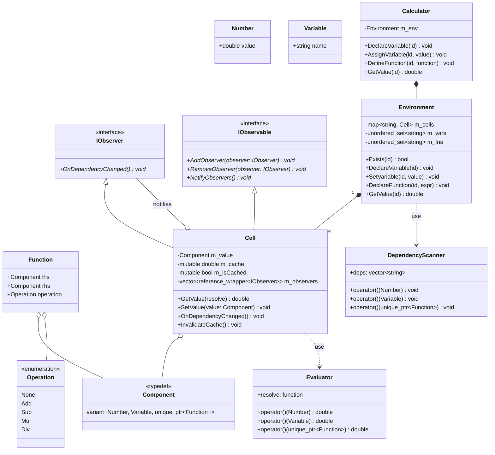

```mermaid
classDiagram
    class IObserver {
        <<interface>>
        +OnDependencyChanged()* void
    }
    
    class IObservable {
        <<interface>>
        +AddObserver(observer: IObserver)* void
        +RemoveObserver(observer: IObserver)* void
        +NotifyObservers()* void
    }
    
    class Operation {
        <<enumeration>>
        None
        Add
        Sub
        Mul
        Div
    }
    
    class Component {
        <<typedef>>
        variant~Number, Variable, unique_ptr~Function~~
    }

    class Number {
        +double value
    }

    class Variable {
        +string name
    }

    class Function {
        +Component lhs
        +Component rhs
        +Operation operation
    }

    class Cell {
        -Component m_value
        -mutable double m_cache
        -mutable bool m_isCached
        -vector~reference_wrapper~IObserver~~ m_observers
        +GetValue(resolve) double
        +SetValue(value: Component) void
        +OnDependencyChanged() void
        +InvalidateCache() void
    }

    class Environment {
        -map~string, Cell~ m_cells
        -unordered_set~string~ m_vars
        -unordered_set~string~ m_fns
        +Exists(id) bool
        +DeclareVariable(id) void
        +SetVariable(id, value) void
        +DeclareFunction(id, expr) void
        +GetValue(id) double
    }

    class Calculator {
        -Environment m_env
        +DeclareVariable(id) void
        +AssignVariable(id, value) void
        +DefineFunction(id, function) void
        +GetValue(id) double
    }

    class Evaluator {
        +resolve: function
        +operator()(Number) double
        +operator()(Variable) double
        +operator()(unique_ptr~Function~) double
    }

    class DependencyScanner {
        +deps: vector~string~
        +operator()(Number) void
        +operator()(Variable) void
        +operator()(unique_ptr~Function~) void
    }
    
    %% Relationships
    IObserver <|-- Cell
    IObservable <|-- Cell
    
    Cell o-- Component
    Function o-- Component
    Function o-- Operation
    
    Environment "1" *-- "many" Cell
    Calculator *-- Environment

    Cell ..> Evaluator : use
    Environment ..> DependencyScanner : use
    
    %% Recursive relationship for observers
    Cell o-- IObserver : notifies
```